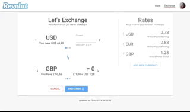

# Exchange App

A responsive React app that implements exchanges between USD, GBP and EUR using the [fixer.io](https://fixer.io/) api.

## Libs

This project use the following libraries:

* React
* Redux
* Ramda
* Material-ui
* Styled components
* Jest
* Enzyme
